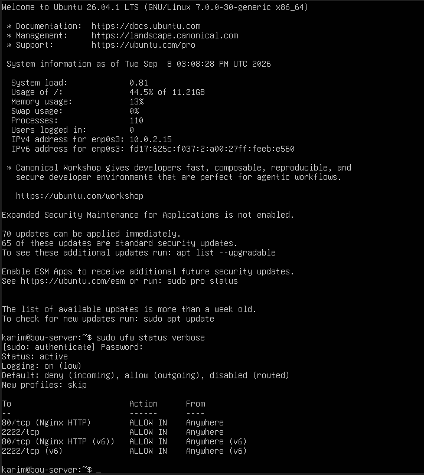

# Enterprise Linux Server Hardening & Security Baseline

## Executive Summary
This repository contains production-ready security hardening guidelines, automated scripts, and custom configuration baselines designed to secure an enterprise Linux server environment against unauthorized access, network-based attacks, and service vulnerabilities.

---

## Technical Specifications & Stack
* **Operating System:** Ubuntu Server 22.04 LTS / Debian 12
* **Security Framework:** CIS Benchmarks / NIST SP 800-53 Guidelines
* **Core Components:** OpenSSH, UFW Firewall, Fail2ban Intrusion Prevention, Shell Automation

---

## Hardening Implementation Details

### 1. SSH Protocol Securing (`sshd_config`)
- Disabled direct root login to eliminate high-privilege targeted attacks.
- Disabled password-based authentication in favor of SSH Public Keys.
- Changed default port to non-standard port `2222` to mitigate automated scanner noise.
- Enforced strict session timeout limits.

### 2. Network Access Control (`UFW`)
- Applied Default Deny Incoming policy.
- Restricted ingress traffic strictly to explicit management services.

### 3. Automated Setup Script (`setup-security.sh`)
An automated Bash script was created and included in this repository to instantly apply network firewall rules, install system updates, and initialize intrusion prevention services upon server deployment.

---

## Verification & Proof of Work

### UFW Firewall Status

